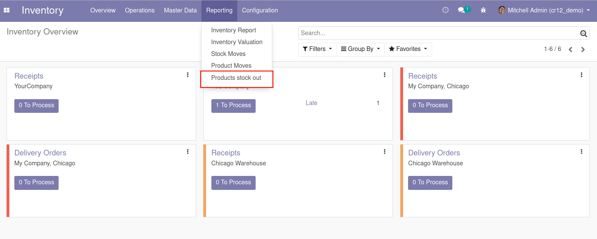
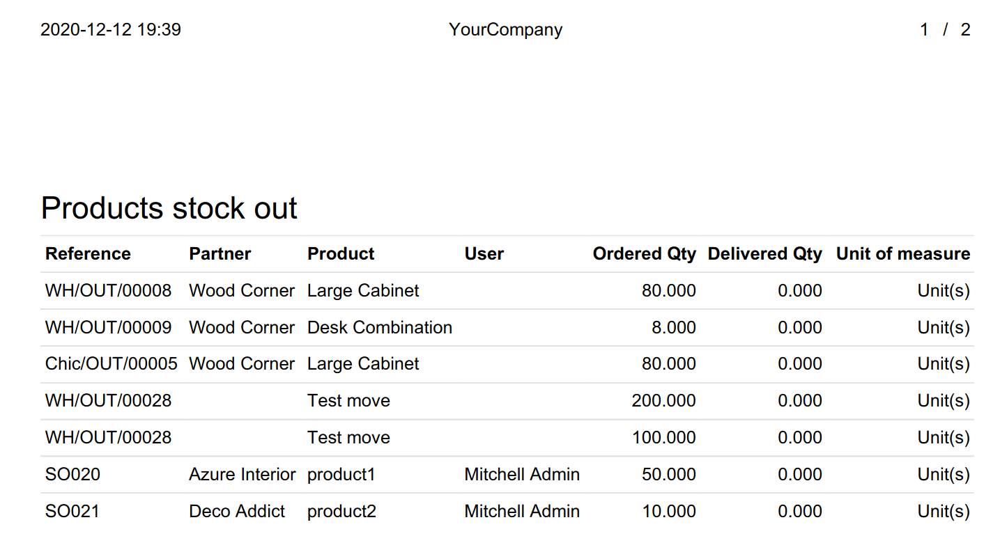
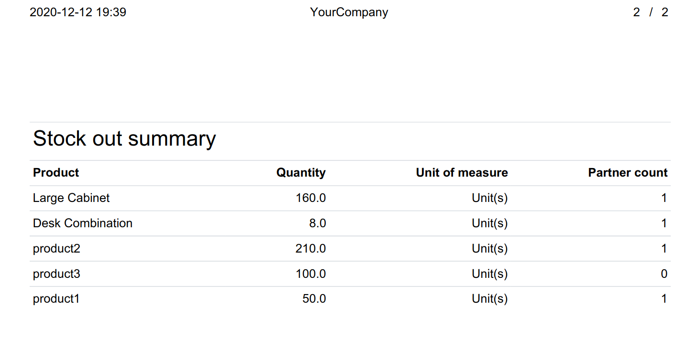

To use this module, you need to:

#. Go to *Inventory > Reporting > Products stock out*
#. Select dates to get stock moves
#. You can do the following actions:

   #. Print a report
   #. Open stock moves affected
   #. Send report by email to recipients

.. image:: ../static/description/wizard.png
    :width: 600 px
    :alt: Wizard

